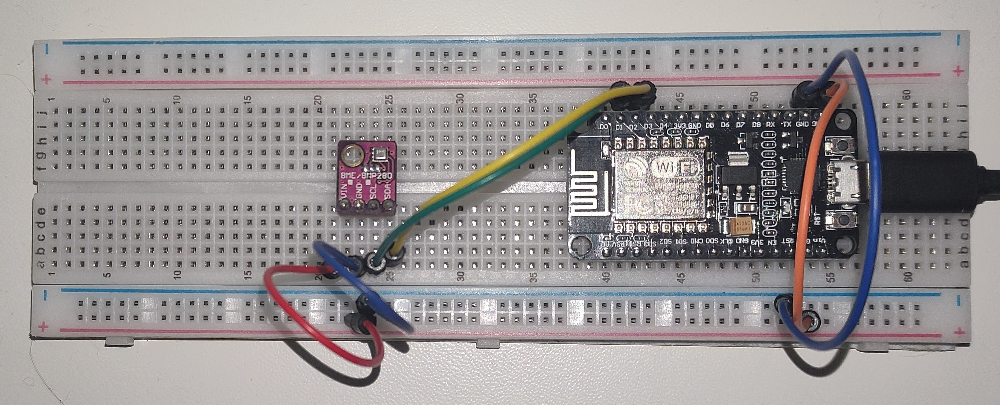

# Arduino home sensors

This is project for ESP8266 Wi-Fi module. Working with meteo sensor BME280.

## Circuit board

## Run

1. Open sketch in Arduino IDE.
2. Install missing libraries.
3. Copy `config.h.example` to the `config.h` and write your constants.
4. Upload sketch.
