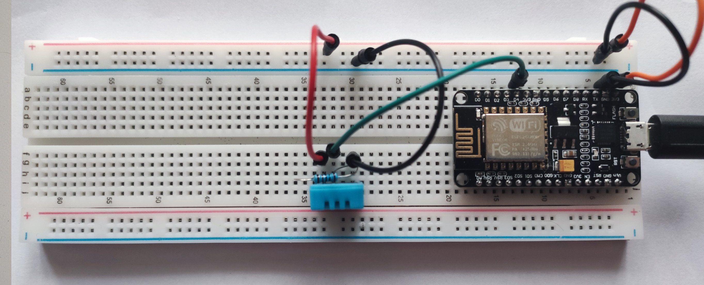

# Arduino home sensors

This is project for ESP8266 Wi-Fi module. Working with meteo sensor BME280 +
DHT11 as second.

## Circuit board

### ESP8266 + BME280

### ESP8266 + DHT11

## Run

1. Open sketch (one of `esp8266_*`) in Arduino IDE.
2. Install missing libraries.
3. Copy `config.h.example` to the `config.h` and write your constants.
4. Upload sketch.
